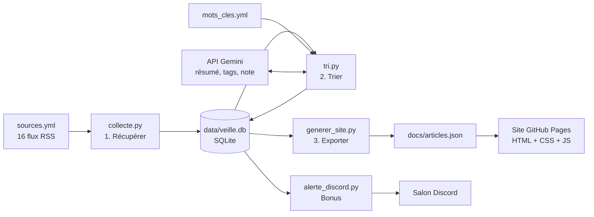

# Veille IA

Outil de **veille technologique automatisée** sur l'intelligence artificielle,
du point de vue d'un développeur. Réalisé dans le cadre du **BTS SIO option SLAM**.

🔎 **Site de la veille :** https://mohamed-ali-akir.github.io/veille-ia/

Chaque jour, le programme récupère les articles de 16 sources (flux RSS), garde ceux
qui parlent d'IA, les fait résumer et noter par une IA (Google Gemini), les stocke
dans une base SQLite et les publie sur un site avec **recherche instantanée**.
Les articles les plus importants sont aussi envoyés sur **Discord**.

## Architecture



Toute la chaîne est lancée **deux fois par jour** par **GitHub Actions**
(`.github/workflows/veille.yml`), sans que mon ordinateur soit allumé.

| Étape | Fichier | Rôle |
|---|---|---|
| 1. Récupérer | `collecte.py` | Lit les flux RSS, ignore les doublons et les articles de plus de 30 jours |
| 2. Trier | `tri.py` | Filtre par mots-clés, puis l'IA écrit un résumé en français, choisit des tags et donne une note de 0 à 5 |
| 3. Stocker | `base.py` → `data/veille.db` | Base SQLite partagée par tous les scripts |
| 4. Retrouver | `generer_site.py` → `docs/` | Exporte les articles en JSON ; le site les affiche avec recherche et filtres |
| Bonus | `alerte_discord.py` | Envoie les articles notés 4 ou 5 sur Discord |
| Qualité | `tests.py` | 21 tests automatiques, lancés avant chaque veille |

## Structure du projet

```
veille-ia/
├── sources.yml            liste des flux RSS (modifiable sans toucher au code)
├── mots_cles.yml          mots-clés du filtre
├── base.py                ouverture de la base SQLite (structure de la table)
├── collecte.py            étape 1 : récupérer
├── tri.py                 étape 2 : trier (mots-clés + IA)
├── generer_site.py        étape 3 : exporter pour le site
├── alerte_discord.py      bonus : alertes Discord
├── chercher.py            recherche en ligne de commande (secours)
├── synthese.py            brouillon de synthèse mensuelle → syntheses/
├── tests.py               tests automatiques
├── data/veille.db         la base de données
├── docs/                  le site web (publié par GitHub Pages)
│   ├── index.html         page de recherche
│   ├── methodologie.html  explication de la démarche
│   ├── style.css          apparence (mode sombre, version mobile)
│   ├── app.js             recherche instantanée et filtres
│   └── articles.json      données (seul fichier généré)
└── .github/workflows/veille.yml   automatisation
```

## Utilisation sur mon PC (Windows)

```bash
py -m pip install -r requirements.txt   # installer les bibliothèques (une seule fois)
py collecte.py                          # récupérer les nouveaux articles
py tri.py                               # filtrer + analyser par l'IA
py generer_site.py                      # mettre à jour docs/articles.json
py alerte_discord.py                    # envoyer les alertes Discord
py -m unittest -v tests                 # lancer les tests
py chercher.py agent                    # chercher un article en ligne de commande
py synthese.py                          # brouillon de la synthèse du mois (syntheses/)
py -m http.server --directory docs      # voir le site sur http://localhost:8000
```

Sous Linux (GitHub Actions), on remplace `py` par `python`.

> ⚠️ GitHub Actions modifie la base deux fois par jour. Avant de travailler sur mon PC,
> je fais toujours `git pull`, pour ne pas avoir deux versions différentes de `veille.db`.

## Secrets (jamais dans le code)

Le dépôt est public : les clés sont dans des **variables d'environnement**.

| Nom | Où le mettre | Rôle |
|---|---|---|
| `GEMINI_API_KEY` | PC : `setx GEMINI_API_KEY "..."` · GitHub : Settings > Secrets and variables > Actions | clé de l'API Gemini |
| `MISTRAL_API_KEY` | idem (facultatif) | IA de secours si pas de clé Gemini |
| `DISCORD_WEBHOOK_URL` | idem | adresse du salon Discord |

## Ajouter une source

Ouvre `sources.yml` et ajoute un bloc :

```yaml
  - nom: Nom du site
    url: https://adresse-du-flux-rss
    categorie: Actualité FR
```
